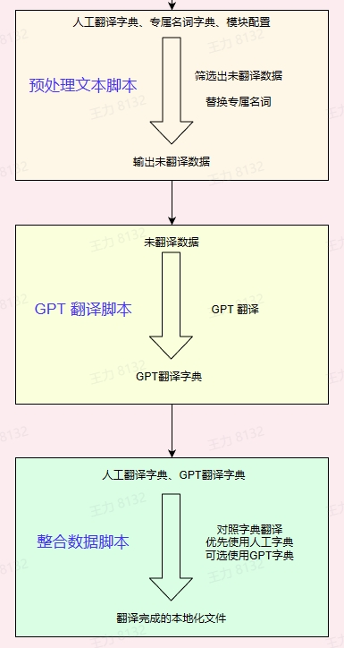

# UE5-GPT-Localization
利用 openai 提供的 API 完成虚幻引擎内文本本地化功能。

数据格式：
|Key|Source|Translation|
|:--:|:-:|:-:|
|A1|test1|   |
|A2|test2|123|
 - - -
# 安装
### 1. 安装 node.js
1. Node.js 的官方网站 https://nodejs.org/。
2. 安装完成后，可以通过以下命令检查 Node.js 是否正确安装  
   `node -v`
3. 如果安装成功，则会显示版本号
### 2. 安装 npm
1. 通过以下命令来安装：  
   `sudo apt-get install npm`
2. 安装完成后，可以通过以下命令检查 NPM 是否正确安装：  
    `npm -v`
3. 如果安装成功，则会显示版本号
 - - -
# 配置
### 1. 环境变量
需要添加环境变量：
    变量名： OPENAI_API_KEY
    变量值： 你在 openAi 官网申请的 Key
### 2. 配置
+ 以下文件配置在本地化的工作环境下，使用导出工具默认路径在 ../content/Localization/Game/语言/...

1. 添加人工翻译表 Translated.tab 
+ 
2. 添加专属名词表 Glossary.tab
+ 
3. 添加模块配置表 module.ini
+ 
# 使用
### 1. 确保第一步的配置没有问题
### 2. 命令
+ 脚本共 3 个 Action ：
1. filter
`yarn run exc filter -p "你的本地化工作路径"`
2. runGPT
`yarn run exc runGPT -p "你的本地化工作路径"`
3. combine
`yarn run exc combine -p "你的本地化工作路径"`
+ 三个命令分别对应如下工作流 
+ 
+ cmd 命令一览
+  
### 3. 使用
+ 按照顺序分别执行三个 action 就能输出翻译好的文件，然后导入项目即可
### 4.注意事项
+ 每个人的 openai 账号权限不同，请根据自己账号权限，修改每次请求的数据量，和请求的频率。
  e.g.   
  1. `yarn run exc runGPT -p "你的本地化工作路径" -cs 100 -cc 10`
  这个示例修改了每次请求的翻译的总字符数量不超过 100 个，并且总短句和词汇数量不超过 10 个
  2. `yarn run exc runGPT -p "你的本地化工作路径" -cd 5000 -tl 10000`
  这个示例修改请求间隔为 5 秒，每个请求时间不超过 10 秒，超过十秒的请求直接失效，根据需求自行修改
+ ./test 路径下有完整的测试环境
